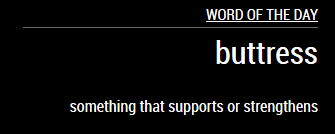

# MMM-MWWordOfTheDay
Magic Mirror Module to show the Word of the day from Merriam Webster's dictionary



# Installation
`cd modules` -> `git clone https://github.com/bittiez/MMM-MWWordOfTheDay.git`

## Add to config:
```
module: 'MMM-MWWordOfTheDay',
position: 'top_right',
config: {
	updateInterval: 120000,
	headerText: "Word of the day"
}
```
